 

## `//` About

I build on-chain products and help them land in African markets. Solidity, Rust and Motoko
on the contract side; React, Next.js and TypeScript on the front. Most weeks involve some of both
engineering and go-to-market — crop insurance that pays out to M-Pesa, payroll that streams by the
second, a prediction market built for this continent.

Based in **Nairobi 🇰🇪**. Open to freelance and contract work.

## `//` Currently

| | Role | What it is |
|:--|:--|:--|
| 🟣 | **Founder** — [KoruFlux](https://koruflux.com/) | Web3 and fintech market entry into Africa, including Kenya's VASP framework |
| 🟢 | **BD & Partnerships** — [MicroCrop](https://www.microcrop.app/) | Growing blockchain crop insurance across Kenya and beyond |
| 🟣 | **Marketing Lead** — [jua.exchange](https://www.jua.exchange/) | An African prediction market |

## `//` Selected work

| Project | What it does | Built with | Year |
|:--|:--|:--|:--|
| **[MicroCrop](https://www.microcrop.app/)** | Parametric crop insurance for smallholder farmers. WeatherXM data triggers payouts automatically, settled straight to M-Pesa. | `React` `Solidity` `Node.js` | 2025 |
| **[Strimz](https://www.strimz.xyz/)** | Token streaming for salaries, subscriptions and utilities. Upload a CSV, set an interval, payments run on schedule. | `Next.js` `Solidity` `TypeScript` | 2024 |
| **[builderUptime](https://projectone.app/)** | Farcaster-native time tracking. Smart accounts mean logging a session takes one tap. | `Next.js` `Smart Accounts` `GraphQL` | 2024 |
| **[AntiKorrupt](https://px7id-byaaa-aaaak-albiq-cai.icp0.io/)** | An AI tutor trained on UN anti-corruption material, wrapped in a game. | `Svelte` `Motoko` | 2024 |
| **[P2P Farmers](https://pm4fe-4iaaa-aaaak-ao7bq-cai.icp0.io/)** 🏆 | Farm-to-consumer marketplace. 3rd place, ICP Mega Hackathon. | `React` `Motoko` | 2023 |

## `//` Stack

## `//` Latest writing

<!-- BLOG-POST-LIST:START -->
- Pulled automatically from [medium.com/@zarahgathoni76](https://medium.com/@zarahgathoni76) once the workflow runs.
<!-- BLOG-POST-LIST:END -->

↑ refreshed daily by GitHub Actions

## `//` The numbers

 

  

 

## `//` Contribution snake

### Building something that needs to work in African markets?

**[zarahgathoni76@gmail.com](mailto:zarahgathoni76@gmail.com)** &nbsp;·&nbsp; **[koruflux.com](https://koruflux.com/)**

Most of what I ship is under contract and lives in private repos — the work above is the public trail.

